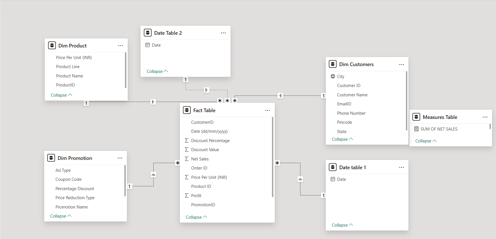

# Electro Hub Analytical Dashboard (Datasource: Excel → Power BI)

### Dashboard Link : https://app.powerbi.com/reportEmbed?reportId=3fc39759-da2c-4ce0-9d2c-e7a16d46136f&autoAuth=true&ctid=4190cc35-fd93-4aa6-9817-c1121132f7e2

## Problem Statement

This dashboard provides an end-to-end analysis of Electro Hub’s retail operations, enabling stakeholders to monitor sales, profit, discounts, and order volumes across multiple product categories and geographies. It helps management understand top and bottom product performance, track sales and profit trends over time, and assess the effectiveness of promotional strategies.

Through the visuals, users can compare sales, profit, and quantity sold across daily, monthly, quarterly, and annual periods, analyze discounts by category, and explore sales distribution by geography and city. The dashboard also highlights the relationship between sales and profit through scatter plots, and enables flexible comparison of performance between two custom date ranges.

The solution integrates Excel data with Power Query for cleaning and transformation, a star schema data model for performance optimization, and Power BI for interactive reporting. Features such as slicers, drill-through, and dynamic measures using DAX enhance interactivity and allow for deeper insights.

Overall, this dashboard empowers Electro Hub’s leadership to identify best- and worst-performing products, evaluate promotional impact, optimize inventory planning, and make data-driven decisions to improve profitability and customer satisfaction.

### Steps followed 

- Step 1: The dataset was provided as an Excel workbook containing four tables: Customer Dimension, Product Dimension, Promotion Dimension, and the Sales Fact Table. These tables were imported into Power BI, and the schema was validated. Using Power Query Editor, applied steps were tracked for all transformations. Column profiling was enabled for the entire dataset to check data quality, column uniqueness, and null counts. Key fields such as Customer ID, Product ID, and Promotion ID were standardized to Text. Headers in the promotion table were corrected, and a numeric percentage column was derived for discount categories. Nulls in price per unit and discounts were handled through merges and replacements. Additional calculated fields such as actual discount value, total sales, and net sales were created to support reporting .

- Step 2: Advanced transformations were applied to make the data analytics-ready. Missing values such as unit price were filled by merging dimension tables into the fact table. Discount percentage values were merged into the fact table, with nulls replaced by zeros. Derived columns were created for Total Sales (Unit Sold × Price per Unit), Discount Value, and Net Sales, ensuring consistency in data types across new fields. These transformations ensured the dataset was structured for downstream analysis .

- Step 3: A star schema was implemented, with the Sales Fact Table at the center linked to the Customer, Product, and Promotion dimension tables. Primary and foreign key relationships were validated, ensuring referential integrity. Relationships were defined as one-to-many with single-direction cross-filtering. Multiple relationships were applied between date tables and the fact table to support custom analytical scenarios such as period comparisons. The schema was organized in the model view to ensure clarity and maintainability .


- Step 4: Multiple visuals were created to address business requirements. On Page 1, bar charts were created to display the top and bottom five products by net sales, profit, and quantity sold. These visuals highlighted the best and worst performers.

- Step 5: On Page 2, sales performance by geography and promotions was analyzed. A table was used to show sales by city, while discount comparisons were represented across different promotion types. A scatter plot was added to represent the relationship between profit and sales, and line charts illustrated time-series sales trends from 2020 to 2024.

- Step 6: On Page 3, dual date filters were introduced to compare sales, profit, and quantity over two custom time periods. Dynamic DAX measures were created to calculate and visualize these comparisons in bar charts.
```DAX
SUM OF QUANTITY SOLD = CALCULATE(SUM('Fact Table'[Units Sold]), all('Date table 1'), USERELATIONSHIP('Date Table 2'[Date], 'Fact Table'[Date (dd/mm/yyyy)]))
```
```DAX
SUM OF PROFIT = CALCULATE(SUM('Fact Table'[Profit]), all('Date table 1'), USERELATIONSHIP('Date Table 2'[Date], 'Fact Table'[Date (dd/mm/yyyy)]))
```
```DAX
SUM OF NET SALES = CALCULATE(SUM('Fact Table'[Net Sales]), all('Date table 1'), USERELATIONSHIP('Date Table 2'[Date], 'Fact Table'[Date (dd/mm/yyyy)]))
```

- Step 7: On Page 4, a detailed table was added to display order-level data such as product, customer, sales, discount, and profit. Multiple slicers for date, product, customer, and promotion were included for interactive analysis.

- Step 8: A dedicated measures table was created to centralize all DAX measures, ensuring consistency and reusability. Examples include Total Sales, Total Profit, and Total Quantity.

- Step 9: The finalized dashboard was published to Power BI Service, enabling interactive exploration and providing stakeholders with clear insights into sales and profitability across Electro Hub’s operations.


# Snapshot of Dashboard (Power BI Service)

 


## Insights  

- The Apple iPhone 14, Apple MacBook Air, and Sony Bravia 55" TV emerged as the top-performing products in terms of net sales and profit, contributing significantly to revenue. In contrast, products like Tupperware Lunch Box, L’Oreal Shampoo, and Colgate Toothpaste recorded the lowest sales and profits, highlighting underperforming categories. Quantity-wise, Apple iPhone 14 and Raymond Suit dominated sales volume, while items like Nivea Body Lotion and Borosil Glass Set were among the least sold.

- Net sales were highest in metro cities such as Bhopal, Kanpur, and Indore, while smaller cities like Bangalore and Hyderabad contributed relatively less. Weekend Flash Sales and Clearance Sales proved to be the most effective promotional campaigns, driving higher discount values compared to others. A strong positive correlation was observed between profit and net sales, confirming consistent profitability across high-sales products. Overall, the company processed 3,510 orders between 2020 and 2024, with notable seasonal spikes in net sales trends.

- The company recorded a total of 122 million in sales, generating 12.2 million in profit, with 7.1K units sold. The performance comparison across two periods showed consistent results, with no major deviation in sales, profit, or quantity. This suggests stable market demand and efficient sales execution during the observed timeframe.

- The detailed transactional data provides insights into customer-level purchases, with information on discounts, sales, profit, and product categories. Products like Apple iPhone and premium electronics consistently generated high-value sales, whereas daily-use items recorded smaller transaction amounts. The table also allows granular analysis of promotional effectiveness, customer buying behavior, and unit-level profitability.

